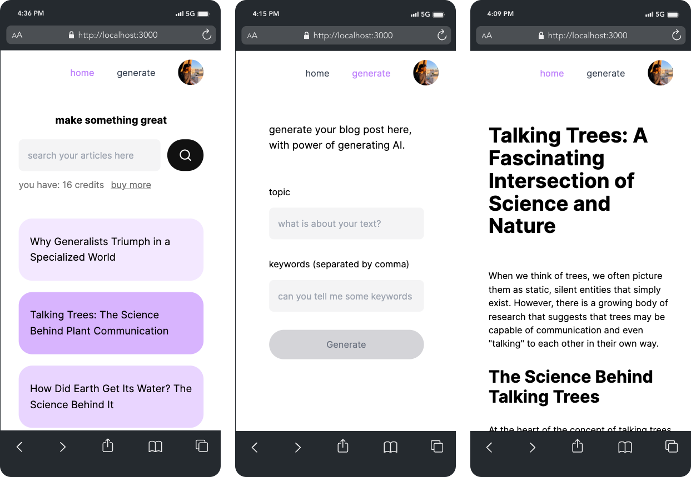

### @nextjs-openai-blog

This project serves as a demonstration of consuming OpenAI APIs and utilizing generative AI (GPT-3.5) to generate blog posts based on specific topics and keywords. Additionally, it includes features such as Auth0 integration and Stripe for managing in-app purchases.

### Screenshots

<br/>
  
<br/>

### Technical Resources

- `Open AI` API integration (GPT-3.5-turbo)
- Usage of `Next.js` framework
- Integration with `MongoDB` to store user blog posts data
- Authentication with `Auth0`
- Integration with `Stripe Payment` for buying digital currency
- `TailwindCSS` and `RadixUI` for create beautifully, responsive and accessible UI

### How to execute

1. Clone this repository

```shell
git clone https://github.com/WillACosta/nextjs-openai-blog
```

2. Make sure that you have all environment variables set, before running the project, run the following command to copy the env file, and then fill in your own credentials.

```shell
cp .env-example .env
```

3. Run the following command

```shell
yarn install & yarn bootstrap
```

By executing this command, all the required dependencies will be installed, and the script will be launched to listen for Stripe responses (webhooks) and effectively handle payment transactions

**you can find more information in the `package.json` file**

#

_Feel free to help me improve and implement new features for this application, and so on. Thank you for being here._
