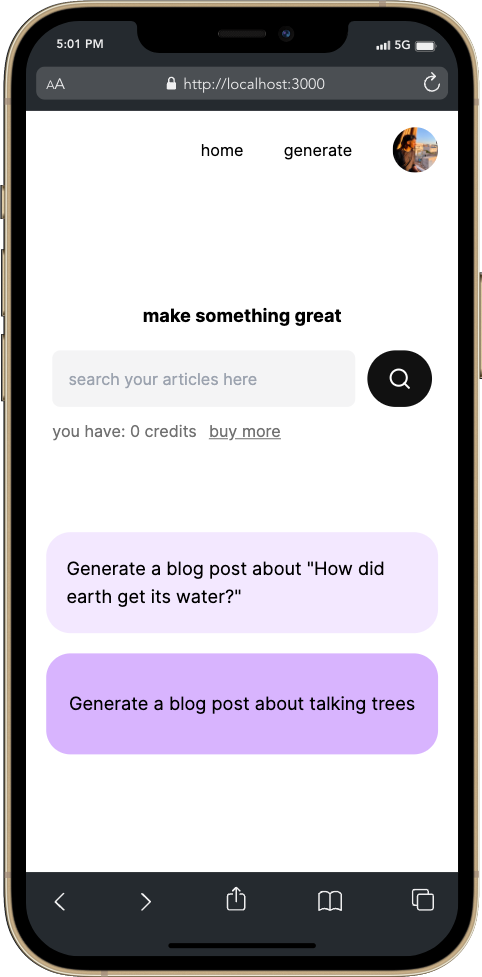

### @nextjs-openai-blog

<!-- <h1 align="center">
  
</h1> -->

This project is a showcase for consuming OpenAI APIs and use of generative AI (GPT-3.5) to create articles for
given topic and keywords, also we've features such as `Auth0` integration and `stripe` for handling in app-purchasing.

_this project is under construction_

### Screenshots
 

 

### Technical Resources

- Authentication with `Auth0`
- Usage of `Next.js` framework
- Integration with `OpenAI` API using `GPT-3.5-turbo` to generate blog posts
- Integration with `Stripe` Checkout to buy digital currency
- `MongoDB` to save user data
- `TailwindCSS` and `RadixUI` for create beautifully, responsive and accessible UI

